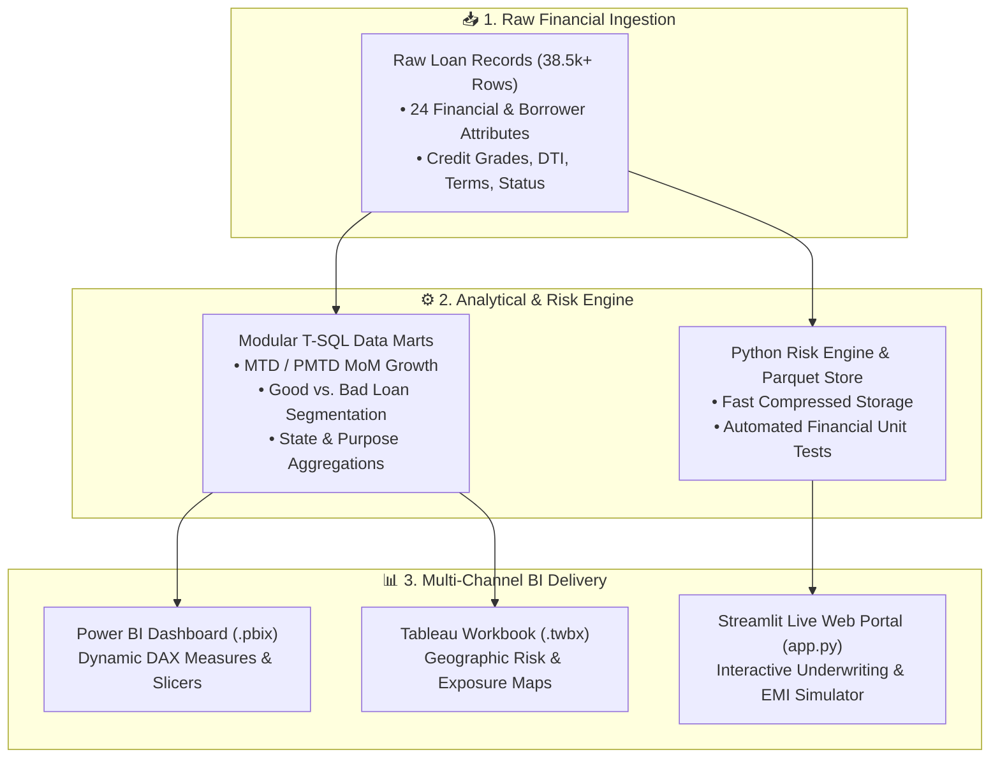

# 🏦 Bank Loan Portfolio & Credit Risk Analytics Platform

[](https://github.com/mahatoaditya24/Bank-Loan-Analysis/actions)
[](https://python.org)
[](https://streamlit.io)
[](https://powerbi.microsoft.com/)
[](https://www.tableau.com/)
[](https://www.microsoft.com/sql-server)
[](LICENSE)

An enterprise-grade **Banking Analytics & Credit Risk Management Platform** engineered to assess retail loan portfolio health, capital recovery efficiency, creditworthiness, and default risk exposure across **38,576+ loan applications** ($435.8M funded capital, $473.1M cash received).

---

## 🏗️ Architecture & Analytical Data Flow



---

## 📈 Executive Portfolio Key Performance Indicators (KPIs)

| Financial Metric | Portfolio Total | MTD (Dec 2021) | PMTD (Nov 2021) | MoM Growth | Strategic Banking Insight |
| :--- | :--- | :--- | :--- | :--- | :--- |
| **Total Loan Applications** | **38,576** | 4,314 | 3,778 | **+14.19%** | Robust seasonal demand spike in Q4 |
| **Total Funded Capital** | **$435,757,075** | $48,824,500 | $42,686,125 | **+14.38%** | Capital deployment aligned with borrower volume |
| **Total Cash Received** | **$473,070,933** | $54,136,870 | $47,654,400 | **+13.60%** | **108.5% Net Capital Recovery Ratio** |
| **Average Interest Rate** | **12.05%** | 12.36% | 11.94% | **+0.42%** | Risk-adjusted yield expansion |
| **Average Debt-to-Income (DTI)** | **13.33%** | 13.67% | 13.30% | **+0.37%** | Healthy borrower debt service coverage |

---

## 🛡️ Good vs. Bad Loans (Credit Risk Segmentation)

The portfolio categorizes loans into two distinct risk classifications based on repayment status:

```
                            ┌───────────────────────────────────────────────┐
                            │      Total Portfolio: 38,576 Applications     │
                            └───────────────────────┬───────────────────────┘
                                                    │
                 ┌──────────────────────────────────┴──────────────────────────────────┐
                 │                                                                     │
                 ▼                                                                     ▼
    ┌─────────────────────────────────────────┐               ┌─────────────────────────────────────────┐
    │ 🟢 Good Loans: 86.18% (33,243 Apps)      │               │ 🔴 Bad Loans: 13.82% (5,333 Apps)       │
    ├─────────────────────────────────────────┤               ├─────────────────────────────────────────┤
    │ • Status: Fully Paid (32.1k) / Current  │               │ • Status: Charged Off (Defaulted)       │
    │ • Funded Capital: $370.2M               │               │ • Disbursed Capital at Risk: $65.5M     │
    │ • Total Cash Recovered: $435.8M         │               │ • Recovered Prior to Default: $37.3M    │
    │ • Net Recovery Profit: +$65.6M (+17.7%) │               │ • Net Capital Charge-Off Loss: -$28.2M  │
    └─────────────────────────────────────────┘               └─────────────────────────────────────────┘
```

---

## 📁 Repository Structure

```
Bank-Loan-Analysis/
├── .github/workflows/
│   └── ci.yml                     # Automated GitHub Actions CI test suite
├── data/
│   ├── bank_loan_data.parquet     # Compressed high-speed Parquet data store
│   └── bank_loan_data.csv.gz      # Compressed Gzip CSV dataset
├── sql/
│   ├── 01_summary_kpis.sql        # MTD/PMTD MoM portfolio summary queries
│   ├── 02_good_vs_bad_loan_analysis.sql # Credit risk & default severity queries
│   ├── 03_portfolio_segmentations.sql   # Regional, Term, Purpose & Employment slicing
│   └── 04_advanced_analytics.sql  # Grade A-G risk matrices & DTI tiering
├── tests/
│   ├── test_kpis.py               # Unit tests verifying portfolio balance & formulas
│   └── test_sql_integrity.py      # Unit tests verifying SQL query file integrity
├── BANK_LOAN_ANALYSIS.pbix        # Complete Microsoft Power BI dashboard
├── tabluebBLA10.twbx              # Tableau visual analytics packaged workbook
├── streamlit_app.py               # Interactive Streamlit Web Application
├── app.py                         # Application alias entrypoint
├── requirements.txt               # Python package dependencies
├── RESUME_BULLETS.md              # ATS-optimized resume bullets & interview guide
└── README.md                      # Comprehensive project documentation
```

---

## 🗄️ Modular SQL Script Catalog

1. **`sql/01_summary_kpis.sql`**: Computes total loan applications, funded principal, cash recovered, average interest rate, and average DTI with Month-To-Date (MTD) vs. Prior-MTD (PMTD) Month-over-Month (MoM) calculations.
2. **`sql/02_good_vs_bad_loan_analysis.sql`**: Segregates performing loans (`Fully Paid`, `Current`) from non-performing loans (`Charged Off`), evaluating net profit margins vs. charge-off loss severity.
3. **`sql/03_portfolio_segmentations.sql`**: Slices portfolio performance across monthly issuance seasonality, 50 US states, loan terms (36 vs 60 months), employment length, loan purpose, and home ownership.
4. **`sql/04_advanced_analytics.sql`**: Analyzes credit grade default curves (Grade A ~5.4% default rate to Grade G ~33.8% default rate) and Debt-to-Income (DTI) risk pricing tiers.

---

## 💻 Local Quickstart & Interactive Dashboard

### 1. Clone the Repository
```bash
git clone https://github.com/mahatoaditya24/Bank-Loan-Analysis.git
cd Bank-Loan-Analysis
```

### 2. Set Up Python Environment & Run Tests
```bash
python -m pip install -r requirements.txt
python -m unittest discover -s tests -p "test_*.py"
```

### 3. Launch the Interactive Web Dashboard
```bash
python -m streamlit run streamlit_app.py
```
*Access the live dashboard at `http://localhost:8501`.*

---

## 🧪 Automated Testing

Automated test suite validates:
- Total portfolio row integrity (38,576 records).
- Good vs. Bad loan mutual exclusivity partition.
- Non-negative financial boundaries (funded amounts, payments, DTI).
- Standard Credit Grade domain validation (Grades A through G).
- Exact monthly EMI amortization formula mathematics.
- SQL syntax tokens and query integrity.

---

## 👤 Author & Contributor

- **Aditya Mahato**
- GitHub: [@mahatoaditya24](https://github.com/mahatoaditya24)
- Email: [adityamahato675@gmail.com](mailto:adityamahato675@gmail.com)
